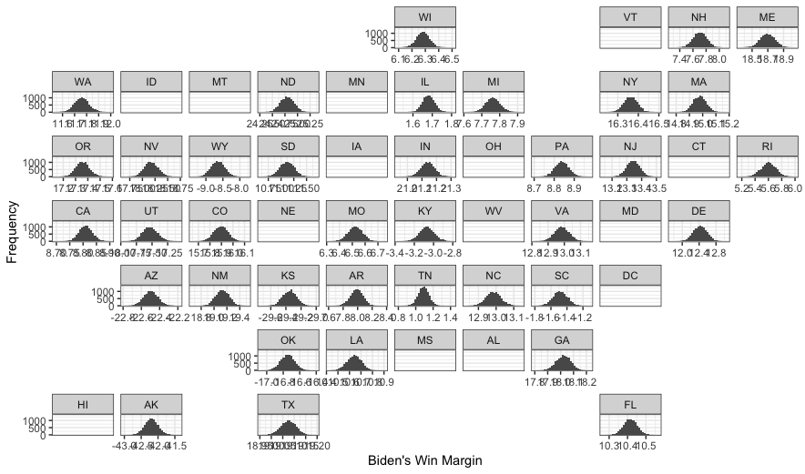

# Polls and Probabilistic Models
## Oct 9, 2020

Throughout previous blogs, I have relied on linear regression models to derive election results. Although such has helped me analyze the relationships between variables like average poll support and popular vote shares, the outcome of a linear regression model can be any value in a continuous range; thus, some predictions (i.e., popular vote share) could be outside the 0-100% range. This clearly reduces the practicality of some of the linear regression results. Therefore this week, I will explore 2020 predictions through probabilistic models, like a binomial logistic regression, limiting election outcomes to a finite draw of voters from a given population (i.e., the voting-eligible population). I will base such probabilistic models on the average poll support for each of the major party candidates in 2020, first considering the entire country and then focusing on the key battleground states in the 2020 election. 

**Win Margins for the United States in 2020**

|Biden's Simulated Win Margins in 2020 |
|:-:|
||

This map demonstrates the 2020 win margins for the Democratic candidate, Joe Biden, relative to the Republican candidate Donald Trump. The win margin is derived from the predicted distribution of draws (10,000 draws) from the population (i.e the voting-eligible population) in each state, with the draw probability for Biden and Trump based on their average support. The main takeaways are:

* **Biden is favored.** From the data available, the probabilistic map of win margins demonstrates that Biden is favored relative to Trump in terms of attaining a greater vote share in 2020. This is evident given the magnitude of Biden's win margins and the states in which Biden's win margins are positive relative to Trump. This takeaway falls in line with models from previous weeks, which demonstrated Biden would have a greater vote share than Trump based on Biden's greater average poll support.

* **Limited data.** As one can see from the map, there are states with missing win margins. This is due to the limited or missing data available for some states, which hinders one's ability to draw more substantive takeaways from the United States' win margins map. Given these limitations, it is necessary to conduct further analysis using probabilistic models; however, focusing only on the key battleground states of the 2020 election.

**Win Margins for the Battleground States in 2020**

This section will consider Biden's 2020 win margins in the 5 battleground states highlighted by the [New York Times.](https://www.nytimes.com/interactive/2020/us/elections/election-states-biden-trump.html) I will again use probabilistic models and rely on average poll support data in each state for the two major-party candidates. By focusing on these battleground states, I will determine which candidate has a higher probability of winning in the pivotal "swing states" and thus the 2020 election. 

Biden's Win Margin in Florida  |  Biden's Win Margin in Ohio
:-------------------------:|:-------------------------:
|

Biden's Win Margin in Georgia  |  Biden's Win Margin in North Carolina
:-------------------------:|:-------------------------:
|

|Biden's Win Margin in Iowa |
|:-:|
||

The breakdown for the above battleground states' win margins are as follows:

* **Florida.** Biden's win margin in Florida is just over 5%. Given Biden's average support in Florida is 48.78%, relative to Trump's average support of 44.71%, Biden's projected win margin closely follows the candidates' average support in the state. Such a win margin also means Biden would carry the pivotal 29 electoral votes from Florida. 

* **Ohio.** Biden's win margin in Florida is approximately -1%. Given Biden's average support in Florida is 46.8%, relative to Trump's average support of 46.66%, Biden's projected win margin slightly understates his marginal advantage in the polls. This also means Trump would carry the 19 electoral votes from Ohio. 

* **Georgia.** Biden's win margin in Georgia is over 5%. Given Biden's average support in Georgia is 47%, relative to Trump's average support of 46.63%, Biden's projected win margin overstates his advantage in the polls by a notable degree. This also means Biden would carry the 16 electoral votes from Georgia. 

* **North Carolina.** Biden's win margin in North Carolina is just over 4%. Given Biden's average support in North Carolina is 48.35%, relative to Trump's average support of 46.47%, Biden's projected win margin slightly overstates his advantage in the polls. This also means Biden would carry the 15 electoral votes from Georgia.

* **Iowa.** Biden's win margin in Iowa falls around -20%. Given Biden's average support in Iowa is 47.13%, relative to Trump's average support of 46.73%, Biden's projected win margin significantly understates his slight advantage in the polls. Such could be due to polls being less predictive in Iowa or there being fewer data in Iowa to draw from. Regardless, this means that Trump would carry the 6 electoral votes from Iowa. 

Based on my probabilistic model and resulting win margins, Biden has a clear advantage in the afromentioned battleground states. In fact, my projected win margins indicate Biden could carry as much as 60 of the total 85 electoral votes in the battleground states. Such is significant, as a decisive win in the battleground states gives Biden a significantly higher chance of winning the overall election. This stands in stark contrast to 2016, where, [as my first blog](First_Blog.md) demonstrated, Trump took the majority of the electoral votes from the swing states, ultimately leading him to victory. 

**Final Takeaways**

In this blog, I used probabilistic models to evaluate the electoral prospects for the 2020 candidates. By calculating the Democratic candidate’s win margin, based on their average poll support, I was able to project that Biden would take the majority of the battleground state electoral votes, and thus stands a greater chance of winning the 2020 election. This analysis affirms previous model predictions based on linear regressions of average poll support. Of course, polls are not the only variable in predicting elections; future probabilistic models could consider incorporating other variables, like incumbency status and 2nd quarter GDP. 

