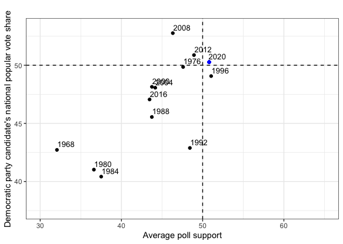
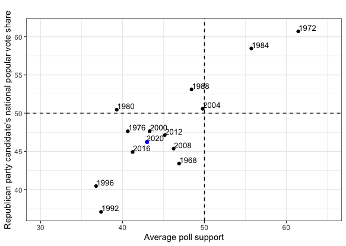
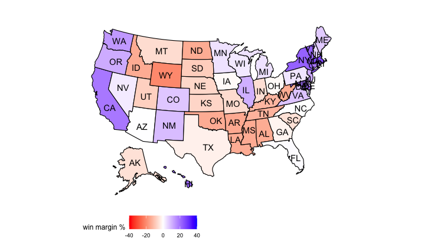

# Final Election Prediction
## Oct 29, 2020

Throughout this past semester, I have analyzed the impacts of variables such as second-quarter GDP, incumbency status, and turnout in a presidential candidate's predicted popular vote share. However, no single variable has been more related or more predictive of a candidate's populate vote share than a candidate's average support in the polls. Given my "best" models have consistently relied on such a variable, my final prediction model for the 2020 election will be primarily based on average support.  

**The Average Support Model** 

My model consists of a linear regression between the popular vote share and average support for Democratic and Republican presidential candidates. I constructed such regression based on popular vote and average support data from 1968 to 2016, or the past 13 presidential election cycles. The model necessarily excludes other variables, like second-quarter GDP, given the model's ambiguous or lack of a significant improvement in its predictive ability from the incorporation of such variables. The formulas and coefficients for both the Democratic and Republican candidate models are demonstrated below: 

* **Democrat average support model.** For Democratic candidates, the formula for the linear regression model based on average support is: predicted popular vote share = 23.4186 + 0.5286 (avg_support). Thus, for every 1% increase in the average support for Democratic candidates, such candidates' predicted popular vote shares increase by 0.5286 percentage points. 

* **Republican average support model.** For Republican candidates, the formula for the linear regression model based on average support is: predicted popular vote share = 12.5561 + 0.7829 (avg_support). Thus, for every 1% increase in the average support for Republican candidates, such candidates' predicted popular vote shares increase by 0.7829 percentage points. This also means my model predicts a greater increase in the popular vote share for Republican candidates, relative to Democratic candidates, when their respective support in the polls rises. 

**Model Validation** 

| Model  | Party |  R-squared | Mean Squared Error  | Leave-One-Out Validation  | Cross Validation  |
|:-:|:-:|:-:|:-:|:-:|:-:|
| Average Support Model  | Democrat  |  0.64  | 2.63 | -0.72  | 1.59  |
|  Average Support Model   |  Republican | 0.72  | 3.35  |  -0.09 |  1.98 |

The in-sample and out-of-sample performance of my model is summarized in the table above. Some of the major takeaways include:

* **In-sample fit.** The in-sample fit for the average support model is fairly strong for both parties. While the r-squared value for the Republican candidate average support model is greater than the r-squared value for the Democratic candidate model, the Democratic candidate average support model has a lower mean squared error relative to the Republican model. 

* **Out-of-sample error.** The out-of-sample error for the average support model is not large either. In fact, the leave-one-out validation value for the Republican canddiate average support model is only -0.09. However, the Democratic candidate average support model has the lower cross validaiton value of the two parties. 

Ultimatley, such validations demonstrate that the average support model for both parties performs relativley well, considering in-sample fit and out-of-sample error. 

**National Election Predictions for 2020** 
Democratic Candidate 2020 Predicted Vote Share  |  Republican Candidate 2020 Predicted Vote Share 
:-------------------------:|:-------------------------:
|

Using the average support model, the above graphs demonstrate my prediction for the 2020 candidates' vote shares (with the blue dot denoting such prediction). While the Republican candidate, Donald Trump, is predicted to receive 46.22% of the popular vote, the Democratic candidate, Joe Biden, is predicted to receive 50.27% of the popular vote. This translates to Trump receiving 47.9% of the two-party popular vote share and Biden receiving 52.1% of the two-party popular vote share. 

Of course, such prediction does not come without uncertainty. The predictive interval associated with Trump's projected popular vote share is between 37.86% and 54.57%. Moreover, the predictive interval associated with Biden's projected popular vote share falls between 43.39% and 57.15%. 

**State-Level Election Predictions for 2020** 

When looking at the individual states, I applied my national model formula to predict the vote shares in each state based on the average support for the candidates in each state. I used the formula and coefficient from the national model to predict the state level popular shares, given the lack of data at the state level between popular vote shares and average support relative to such data at the national level. This model will therefore assume such individual state biases will cancel out. 

| Projected Win Margins Map for 2020 |
|:-:|
||

the win margins constructed using pv2p differences, win margins for Biden. while blue states denoted as blue, red states denoted as red, white states are battleground states, tight win margins. according to this model, biden is projected to get X electoral votes, compared to trump's 207. 

uncertainity. Similar to natioanl model, some uncertainity with prediciton. especially cosiderinng average support data in 2020 between each state varied, some have more/better polls. also assuming biases in each state not too strong.

**Final Takeaways** 

ultaitmely, model projects strong biden winn, natioanl level and electorally. 
average support model seems strong, good in and out performance
some uncertainity, but reflects variable i have worked with throughout semester, strong performance. 

