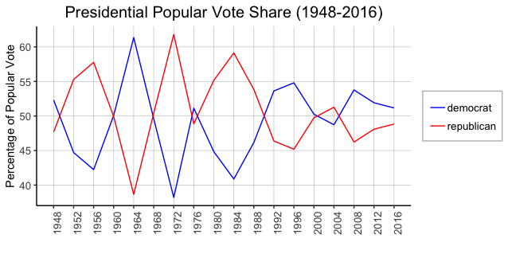
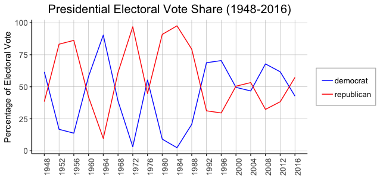
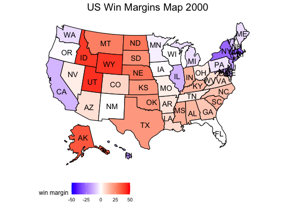
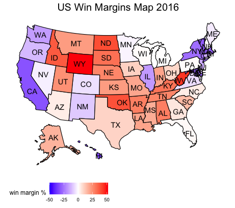

# The Electoral Vote
## Sept 12, 2020

The electoral college has been a staple in American elections since the country's first presidential race. However, it's deviation from the popular vote in recent elections and its apparent bias towards a single party have caused increased scrutiny on such a system. Thus, this blog will seek to evaluate these concerns by comparing trends between the electoral and popular vote, as well as analyzing key races in which the electoral vote has deviated from the popular vote. 

**Trends in Electoral and Popular Vote Shares** 

Popular                  |  Electoral
:-------------------------:|:-------------------------:
|

To understand the recent controversy surrounding the electoral vote, it's important to first develop a firm understanding of the trends between the popular and electoral vote shares attained by the two major parties. These trends are plotted above, using popular and electoral vote data from the years 1948-2016. Some of the major takeaways include:  

* **A strong relationship.** The electoral vote has historically been highly related to the popular vote, with the shape of the two graphs proving largely consistent with one another. Throughout the election cycles from 1948-1996, both the electoral and popular vote share graphs reflect blowout years for Democrats and Republicans alike; similarly, both graphs show tightening races between the two parties from 2000-2016. 

* **Overstated vote shares.** Although both vote shares follow similar trends, its apparent that the vote share ascertained by the majority party is overstated in the electoral vote when compared to the popular vote. For example, while the Republican candidate attained approximately 59% of the two-party popular vote in 1984, they attained approximately 97% of the two-party electoral vote. This is largely a product of winner-take-all system for allocating electoral votes present in most states, which typically overstates popular vote win margins ([Congressional Research Service](https://fas.org/sgp/crs/misc/R43823.pdf)). 

* **Similar winners.** Overall, the graphs demonstrate that the candidate with the higher popular vote share has been the candidate with the higher electoral vote share, and thus the winner of the election. Only in the 2000 and 2016 election cycles was this not the case, as the candidates with the greater electoral vote share had the minority of the popular vote share. 

**Election of 2000** 

To further understand the concerns with the electoral college, it’s necessary to analyze the races with which the electoral vote winer did not match the popular vote winner. One of these races is the election of 2000, between Republican candidate George W. Bush and Democratic candidate Al Gore. 

**Swing states.** The impact of the electoral vote in this election is perhaps best expressed by the swing states, denoted as the whiter colored states in the map. For simplicity, we will mainly consider "swing states" as states with a maximum popular vote win margin of 2 percent. The swing states for this election are: Florida, Iowa, New Hampshire, Oregon, and Wisconsin. 

When solely considering the two-party swing vote electorate, Bush won 49.96% of the popular vote, or 6,057,995 votes. Concurrently, Bush won 49.15%, or 29 of the 59 available electoral votes from these swing states. 

On the other hand, Gore won 50.04% of the popular vote, or 6,067,230 of the votes available in these states. Similarly, Gore won 50.85%, or 30 of the 59 total electoral votes from these states. 

Clearly, the impact of the electoral vote through the overstatement of the winner was not as impactful in this race as one might have initially assumed. Although such overstatement effect is still clearly evident through Florida, which offered 25 electoral votes, the slim victories won by Gore in other swing states virtually nullified these effects. Thus, the results from this race tend to reaffirm the closeness of the electoral vote in comparison to the popular vote observed earlier, while potentially mitigating some claims of its bias. 

**Election of 2016**

The second race we will analyze is the election of 2016, between Republican candidate Donald Trump and Democratic candidate Hilary Clinton. 

**Swing states.** Like in the last election we covered, we will estimate the impact of the electoral vote through the swing states, again denoted as the whiter colored states with at maxmimum a 2% win margin. The swing states for this election are: Florida, Michigan, Minnesota, Pennsylvania, and Wisconsin. 

When solely considering the two-party swing vote electorate, Trump won 50.28% of the popular vote, or 12,942,185 votes. However, Trump won 84.27%, or 75 of the total 89 available electoral votes from these states. 

On the other hand, Clinton won 49.72% of the popular vote, or 12,799,022 of the votes available in these states. Yet, Clinton only won 15.73%, or 14 of the the total 89 electoral votes from these states. 

Here, unlike in the election of 2000, the impact of the electoral vote through the overstatement of the winner is evident. There is a significant gap between the electoral and popular vote share between the two major parties in the swing states, disproportionately favoring the republican candidate. Although claims of electoral bias are difficult to prove, this election demonstrates how significant the overstatement effect of the electoral college could be in presidential races. 

**Final takeaways** 

Overall, our analysis has demonstrated that the electoral vote tends to follow the popular vote but overstates the vote share attained by a given candidate. Although this overstatement effect did not play as big of a role in the election of 2000, it played a major role in the election of 2016. Given the trend of tightening presidential elections, it's hard to imagine the electoral vote won't continue to play a contentious and important role in future elections, especially if the main benefactors from the overstatement effect remain Republican candidates. 

