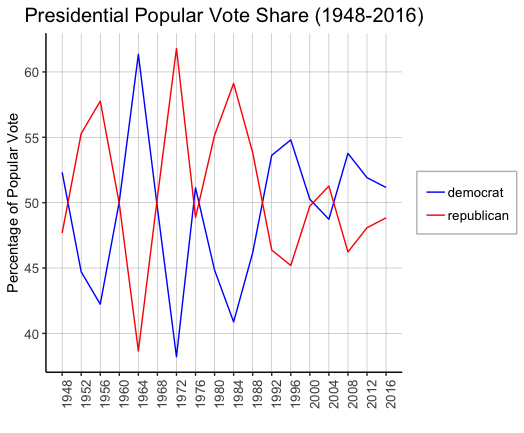

# Introduction: Past Presidential Election Results
## Aug 30, 2020

Predictions of the future are based on the patterns of the past. If X tended to predict Y well in the past, we would want to use that X in our model. So we start our journey by looking into past presidential election results -- first two-party voteshare at the national level. 

**Elections are generally competitive between the two parties.** One thing in particular stands out: in the last 60 or so years, the race for the presidency has overall been *remarkably competitive between the two major parties*. Since FDR, neither Republicans nor Democrats have maintained a monopoly over the White House, if we look at two-party voteshare:

 

The first half of the twentieth century experienced greater swings and greater margins of victory, while point spreads in the last 20 years have been less than 10 points. The 3 <u>closest</u> elections in the last 60 years and their "prevailing narratives" are:

* **2000, margin of `0.5%` or 500k votes or `5 EV` (Bush vs. Gore).** Gore managed to distance himself from Clinton's scandals (which put him neck-and-neck with Bush); though, really, this was anyone's election.

