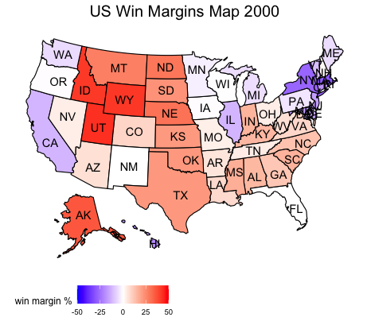

# The Electoral Vote
## Sept 12, 2020

The electoral college has been a staple in American elections since the country's first presidential race. However, it's deviation from the popular vote in recent elections and its apparent bias towards a single party have caused increased scrutiny on such a system. Thus, this blog will seek to evaluate these concerns by comparing trends between the electoral vote share and popular vote share, as well as analyzing key races in which the electoral vote has deviated from the popular vote. 

**Trends in Electoral and Popular Vote Shares** 

Popular                  |  Electoral
:-------------------------:|:-------------------------:
|

In order to understand the recent controversy surrounding the electoral vote, it's important to first develop a firm understanding of the trends between the popular and electoral vote shares attained by the two major parties. These trends are plotted above, using popular and electoral vote data from the years 1948-2016. Some of the major takeaways include:  

* **Strong relationship.** The electoral vote has historically been highly related to the popular vote, with the shape of the two graphs proving largely consistent with one another. Throughout the election cycles from 1948-1996, both the electoral and popular vote share graphs reflect blowout years for Democrats and Republicans alike; similarly, both graphs show tightening races between the two parties from 2000-2016. 

* **Overstated vote shares.** Although both vote shares follow similar trends, its apparent that the vote share ascertained by the majority party is overstated in the electoral vote when compared to the popular vote. For example, while the Republican candidate attained approximately 59% of the two-party popular vote in 1984, they attained approximately 97% of the two-party electoral vote. This is largely a product of winner-take-all system for allocating electoral votes present in most states, which typically overstates popular vote win margins ([Congressional Research Service](https://fas.org/sgp/crs/misc/R43823.pdf)). 

* **Similar winners.** Overall, the graphs demonstrate that the candidate with the higher popular vote share has been the candidate with the higher electoral vote share, and thus the winner of the election. Only in the 2000 and 2016 election cycles was this not the case, as the candidates with the greater electoral vote share had the minority of the popular vote share. 

**Election of 2000** 

**Election of 2016**

