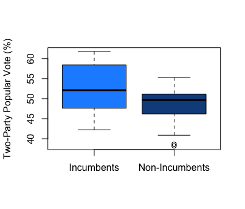

# The Incumbency Advantage and Time For Change Model
## Oct 2, 2020

It is common knowledge in the political science space that incumbents tend to perform better than non-incumbents in elections. In fact, since 1932, only three presidents have failed their re-election bids. But such begs the question, how does this incumbency advantage affect election predictions? In this blog, I will explore this question, first by analyzing the historical popular vote share of incumbent candidates vs. non-incumbents. Then, I will highlight how the incumbency advantage is factored into models like the "time-for-change" model. Finally, I will compare the time-for-change model to model's from previous weeks and evaluate such on their in-sample fit and out-of-sample error. 

**The Relationship between a Candidate's Incumbency Status and Two-Party Popular Vote Share** 

|Incumbency Status vs. Two-Party Popular Vote Share (1948-2016) |
|:-:|
||

To understand how incumbency status can affect election predictions, it is necessary first to understand the relationship between a candidate's incumbency status and two-party popular vote share. The boxplots above display historical trends for such, stratifying candidates based on their incumbency status and displaying each set of candidates' two-party popular vote shares from 1948 to 2016. Some of the major takeaways include:

* **A higher median vote share for incumbents.** The boxplots indicate that an incumbent candidate's two-party vote share has historically been higher than a non-incumbent candidates' two-party popular vote share. This is evident given the greater median two-party vote share for incumbent candidates relative to non-incumbent candidates, which fits in with the commonly held notion that incumbents perform better than non-incumbents.

* **Greater spread for incumbets.** The graphic also illustrates a greater spread of two-party vote share figures for incumbent candidates than non-incumbent candidates. In other words, while the middle 50% of popular vote shares fall between 48.24% and 58.10% for incumbent candidates, the middle 50% of popular vote shares for non-incumbent candidates only falls between 46.21% and 51.14%. 

**The Time-For-Change Model** 

The time-for-change model is a linear regression model that leverages the afromentioned incumbent advantage among other variables to predict an incumbent party candidate's two-party popular vote share. 

The first component of this model is the election-year second-quarter GDP. In my second blog (link on words), I established how this fundamental variable is the most predictive economic measure relative to all others; thus, its inclusion in the time-for-change models is justified. 

The second component is the incumbent president's net approval rating in the latest Gallup poll. This holds the incumbent party candidate's popular vote share relative to the current serving president's job approval ratings, given voters view elections as a referendum on parties currently holding power (source?).

The third component is the incumbency status. As previously mentioned, this allows the model to factor in the incumbency advantage in election predictions. More specifically, the model factors that incumbency status is associated with a 2.87 percent increase in the incumbent party candidate's two-party popular vote share. 

Ultimately, the time-for-change model has been historically successful, with such model only having a true out-of-sample popular vote prediction error of 1.7%. Nevertheless, it's necessary to evaluate such model against others to determine its predictive ability. 

**Evaluating Prediction Models** 

|Model | Variable(s)  | R-squared  | Mean Squared Error   | Leave One Out Validation   | Cross Validation  |
|:-:|:-:|:-:|:-:|:-:|:-:|
| Time-For-Change | Second Quarter GDP, Net Approval, Incumbency Status | 0.685 | 2.875  | -2.856  | 1.45034  |
| Week 3 | Average Support  |   |   |   |   |

