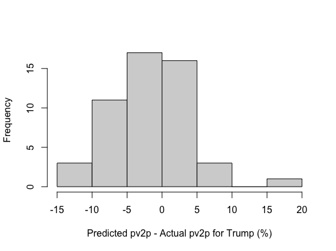
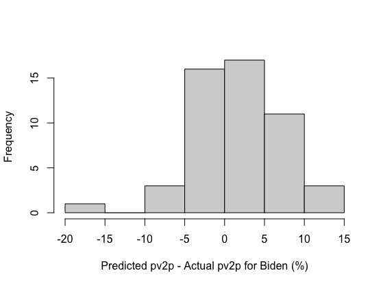

# Post-Election Reflection 
## November 17, 2020

Intro lines before this. 
In this blog, I will seek to provide a comprehensive reflection on my final prediction model. I will do this by first recapping such model and its main predictions. Then, I will touch on its inaccuracies, specifically highlighting the trends I found in such. Given such inaccuracies, I will propose two main hypotheses for why the model was inaccurate at times and propose quantitative tests that could test the validity of these hypotheses. Ultimatley, I will end by touching on how I might change my model if I were to do it again. 

**The Average Suppot Model and its Predictions**

My model, the average support model, consists of a linear regression between the popular vote share and average support for Democratic or Republican presidential candidates. The regression for the Democratic and Republican candidate average support models is based on national popular vote and average poll support data for presidential election candidates from 1968 to 2016. The formulas for each party's average support model are listed below:

* Democrat average support model: predicted popular vote share = 23.4186 + 0.5286 (average support)

* Republican average support model: predicted popular vote share = 12.5561 + 0.7829 (average support)

I used such models the derive the national and state-level two-party popular vote shares for each two-party candidate in the 2020 election, based on national and state-level average support data from the 2020 election cycle, respectively. Ultimatley, my average support models predicted that Trump would receive 47.9% of the two-party popular vote share, and Biden would receive 52.1%. Moreover, I predicted that Trump would attain 219 electoral votes, and Biden would attain 319 electoral votes. Below is the list of the states my models predicted that each candidate would win (and receive their electoral votes from):

Democrat states: DC, MA, RI, NY, VT, HI, MD, CA, CT, DE, WA, NJ, OR, IL, NM, VA, CO, ME, NH, MI, MN, PA, WI, NV, FL, AZ

Republican states: NC, IA, OH, GA, TX, AK, SC, IN, MT, MO, NE, KS, UT, SD, KY, TN, LA, AL, ND, WV, MS, ID, OK, AR, WY

Of course, such predictions did come with some uncertainty. For instance, the predictive interval for Trump's national projected popular vote share was between 37.86% and 54.57%; the predictive interval for Biden's national projected popular vote share was between 43.39% and 57.15%. Moreover, I anticipated further uncertainty on the state-level, given variation between different states on their polls' frequency and quality. 
(could include something about bias here, or maybe remove this section entirely).

should I justify application to state? probs not, will roast it and mention it later on in hypothesis 1 (in my predictions, I assumed model could be applied to each state.....but did not account for bias...)

**Evaluating The Average Suppot Model's Accuracy**

Given the afromentioned uncertainty, I anticipated some error for each of my predictions. Nevertheless, my model was very accurate on the national level, with Trump and Biden's actual two-party popular vote shares (48% and 52%, respectively) being extremely close to my model's predictions for such candidates (47.9% and 52.1%, respectively). On the state level, my model also performed relatively well, although not to the same degree. For instance, my model's predicted electoral vote tally for each candidate (219 and 319 for Trump and Biden, respectively) was not far off from the actual electoral vote tally for Trump and Biden (232 and 306, respectively). My model's incorrect prediction of a Trump win in Georgia, and a Biden win in Florida accounts for such deviation in electoral vote tally's. The graphs below summarize the distribution of the state-level two-party popular vote error for both candidates. 

Trump's State-Level Two-Party Popular Vote Error   |  Biden's State-Level Two-Party Popular Vote Error
:-------------------------:|:-------------------------:
|

Such indicate my model underestimated Trump and overestimated Biden across the majority  of the states. This led to the RMSE for my state-by-state error to be X. As for which states my model was associated with particularly high error, look at the map below:

Map 

This map demonstrates that my model performed worse in some states, like X and Y, than others, like X and Y. Geographically, the spread of my state errors does seem to be varied, although there does seem to be a consolidation of errors in the midwest region. However, this could be a product of such states being blowout states as well, given that other areas, like DC or VT, don't fit this midwest pattern, while other midwest states, like X and Y, don't fit this either. Interestingly, the states my model performed the worst in did not seem to be the states I called wrong, like FL or Georgia, but rather the blow out states. This is further demonatrated by the graphs below:

Graphs

Graphs demonstrate that blow out state and high error states are very similar. in fact, RMSE of blowout states much higher than RMSE average of all states. ultimatley, model was fairly accurate, getting national predictions right, but varying more state by state, especially in blow out states. 

