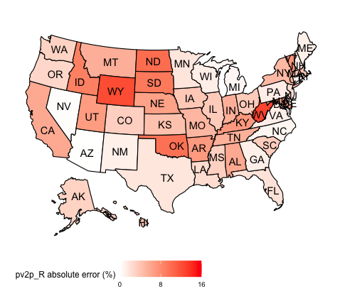
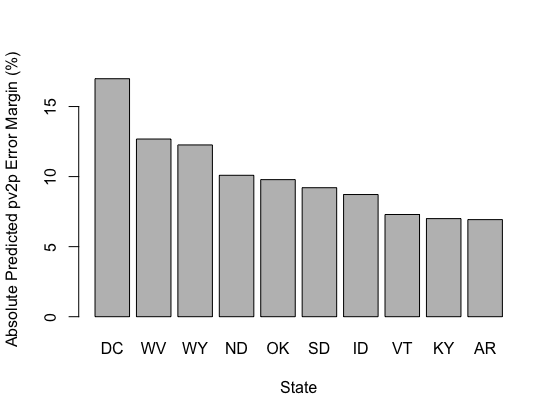
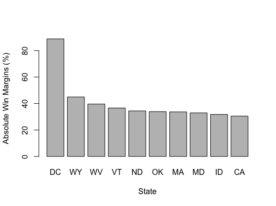

# Post-Election Reflection 
## November 17, 2020

In this blog, I will seek to provide a comprehensive reflection of my final prediction model. I will do this by first recapping the average support model and its main predictions. Then, I will detail its inaccuracies and explicitly highlight the states such inaccuracies were most prevalent. In turn, I will propose two hypotheses for why my model was inaccurate at times and suggest quantitative tests that could test these hypotheses' validity. Ultimatley, I will end by noting how I might change my model if I were to do it again. 

**The Average Suppot Model and its Predictions**

My model, the average support model, consists of a linear regression between the popular vote share and average support for Democratic or Republican presidential candidates. The regression for the Democratic and Republican candidates' average support models is based on national popular vote and average poll support data for presidential election candidates from 1968 to 2016. The formulas for each party's average support model are listed below:

* Democrat average support model: predicted popular vote share = 23.4186 + 0.5286 (average support)

* Republican average support model: predicted popular vote share = 12.5561 + 0.7829 (average support)

I used such models the derive the national and state-level two-party popular vote shares for each two-party candidate in the 2020 election, based on national and state-level average support data from the 2020 election cycle, respectively. Ultimatley, my average support models predicted that Trump would receive 47.9% of the two-party popular vote share, and Biden would receive 52.1%. Moreover, I predicted that Trump would attain 219 electoral votes, and Biden would attain 319 electoral votes. Below is the list of the states my models predicted that each candidate would win:

Democrat states: DC, MA, RI, NY, VT, HI, MD, CA, CT, DE, WA, NJ, OR, IL, NM, VA, CO, ME, NH, MI, MN, PA, WI, NV, FL, AZ

Republican states: NC, IA, OH, GA, TX, AK, SC, IN, MT, MO, NE, KS, UT, SD, KY, TN, LA, AL, ND, WV, MS, ID, OK, AR, WY

Of course, such predictions did come with some uncertainty. For instance, the predictive interval for Trump's national projected popular vote share was between 37.86% and 54.57%; the predictive interval for Biden's was between 43.39% and 57.15%. Moreover, I anticipated further uncertainty on the state-level, given the variation between different states on their polls' frequency and quality. 

**Evaluating The Average Suppot Model's Accuracy**

Overall, my model was quite accurate on the national level, with my model's predictions for Trump and Biden's two-party popular vote shares (47.9% and 52.1%, respectively) being extremely close to Trump and Biden's actual two-party popular vote shares (48% and 52%, respectively). My model also performed relatively well on the state level, although not to the same degree as my national level predictions. For instance, my model's predicted electoral vote tally for each candidate (219 and 319 for Trump and Biden, respectively) was not far off from the actual electoral vote tally for Trump and Biden (232 and 306, respectively). My model's incorrect prediction of a Trump win in Georgia, and a Biden win in Florida accounts for such deviation in electoral vote tally's. The graphs below summarize the distribution of the state-level two-party popular vote share errors for both candidates. 

| Trump's State-Level Two-Party Popular Vote Error |
|:-:|
||

These graphs illustrate that my average support model underestimated Trump's two-party popular vote share and overestimated Biden's two-party popular vote share in the majority of states. This led my model's state-level predictions to be associated with an RMSE value of 5.64. Of course, my model's prediction error varied between each state. The map below illustrates the absolute error margin of my model's predictions for Trump in each state:

| Abolsute Error Margin Map for the Average Support Model |
|:-:|
||

This map demonstrates that the absolute error associated with my model's predictions varied significantly between different states, i.e., my model had a high prediction error margin in states like West Virginia and Wyoming but a low prediction error margin in states like Nevada and Arizona. Geographically, each region of the United States has some states with high prediction error margins, although there seems to be a consolidation of such states in the midwest. However, this could merely be a product of the midwest containing a high number of blowout states in the 2020 election, which my model seemed to perform the worst in. 

Top 10 States with the Greatest Absolute Prediction Error   |  Top 10 States with the Greatest Absolute Win Margins
:-------------------------:|:-------------------------:
|

The graphs above display the ten states associated with the highest prediction error and actual win margin. Such gives credence to the notion that my model's prediction error was more prevalent in "blowout" states, given seven out of the ten states with the highest actual win margin were also the states with the highest prediction errors. In fact, the RMSE of the ten states with the highest actual win margin was 10.07; this is substantially higher than the RMSE across all the states (5.64). 

**Hypotheses for the Average Support Model's Inaccuracies**

Although there might be several reasons why my model was inaccurate in certain states, I will mainly consider two hypotheses: my model's lack of accounting for specific state biases and the variation in poll quality and frequency between different states. I will also propose quantitative tests that could evaluate the validity of each hypothesis. 

**Hypothesis #1**

My first hypothesis for my model's inaccuracy in individual states is that it did not account for their state-specific biases. As mentioned, I constructed the average support model based on a regression of historical popular vote and average poll support data on the national level. Thus, my model's application onto each state implicitly assumes the relationship between a candidate's popular vote and average support is the same on the state-level as the national level; however, this might not be the case. For instance, polls in blowout states, like deeply red Wyoming, might historically underestimate the Republican candidate's actual vote share. Given my model does not factor such bias in, its predictions would then understate Trump's vote share in the region and lead to the error I observed. This type of state bias has some basis, given, as [Nate Silver points out](https://fivethirtyeight.com/features/what-state-polls-can-tell-us-about-the-national-race/), that it is not uncommon for polls in historically blue or historically red states to underestimate the winning candidate's margin. 

My proposed quantitative test for such a hypothesis would be to run regressions between historical average support and popular vote data for each state, particularly the states my model predicted inaccurately. In a perfect world, such historical data would be available and span multiple election cycles. If the individual state average support models derived from such regressions yielded state-level popular vote predictions that were significantly closer to the actual popular vote shares of the 2020 candidates than my model's state predictions, such would suggest my model's lack of accounting for state-specific biases caused a significant portion of the inaccuracy in my model's predictions. 

**Hypothesis #2**

My second hypothesis for my model's inaccuracy in individual states is the variation in poll quality and frequency between states. The average support model relies on the historical relationship between a candidate's average support and popular vote share, with the average support variable based on an average of many national polls. To apply such a model to individual states, I implicitly assumed the state-level average support variables would be as comprehensive as the ones used to construct my national average support model. Thus, an individual state's poor or infrequent polling would deviate from this assumption and account for the error in my model's popular vote predictions for such a state. This hypothesis is reasonable in the context of where my model's prediction errors are most prevalent, i.e., blowout states, given such states' polling are likely not as comprehensive as those of swing states due to the greater importance prescribed to the latter. Historically such has been the case, with swing state polls performing well relative to blowout state polls (https://fivethirtyeight.com/features/how-accurate-have-state-polls-been/). 

My proposed quantitative test for such a hypothesis would be to evaluate each state's polls' quality and frequency in the 2020 election. The poll quality in specific states would be based on a given pollster's historical accuracy and methodology, similar to the pollster rating system by FiveThirtyEight (https://fivethirtyeight.com/features/how-fivethirtyeight-calculates-pollster-ratings/). If the quality and frequency of the polls in a state my model performed poorly in were low, such would be evidence that the low quality and frequency of such a state's polls contributed to my model's prediction error in such a state. As an example, using FiveThirtyEight's pollster ratings, I can observe that the frequency and quality of the polls in North Dakota, a blowout state my model performed poorly in, was significantly lower than the frequency and quality of polls in Georgia, a swing state my model performed accurately in; thus, such provides evidence for my second hypothesis. Perhaps more simply, I could also measure the margin of error between the average poll support in a state and its actual popular vote shares as a proxy for poll quality and frequency. If states with high error margins were correlated with states my model had a high prediction error, such could similarly provide evidence for my second hypothesis. 

**Final Recap and Potential Model Changes**

Ultimatley, my average support model was relatively accurate at predicting the 2020 election. This was most apparent with its national popular vote predictions and less so in its state-level predictions, where my model performed particularly poorly in blowout states. Given my model's prediction errors and the proposed hypotheses why such errors occurred, there are several ways I would consider changing my model. 

Mainly, I would consider making my model more state-specific. Given individual state data constraints, I would likely do this by grouping similar states and conducting regressions between the historical average support and popular vote data in these grouped states. This would ensure my new average support models better accounted for the biases and systematic polling errors of certain states (i.e., blowout states) while still having enough data to ensure the regressions and associated models were robust. Given my interest in controlling for the error in blowout states, I would group states via their historical two-party popular vote margins. For instance, if a few states have historically voted Republican by a large margin (i.e., Wyoming, North Dakota, etc.), I would group such strong red states and create an average support model specific to the individual biases of such states. 

Of course, I might also consider adding other vairables, like incumbency status, or replacing the average support variable altogether with another, like second-quarter GDP, given the issues related to the lack of historical individual state poll data. However, I would only consider these changes in the absence of being able pursue the previous main method of changing my model. Regardless, further data from future elections will continue to improve my model and its predictions. 

