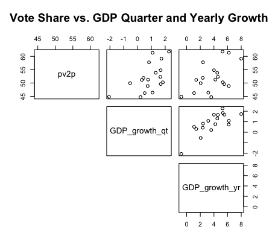
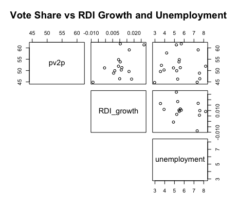
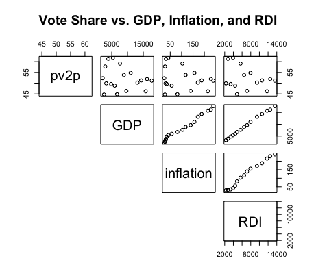
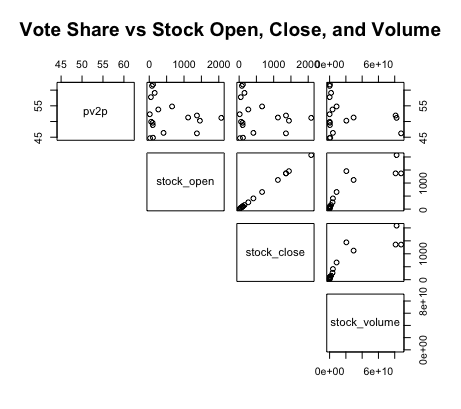
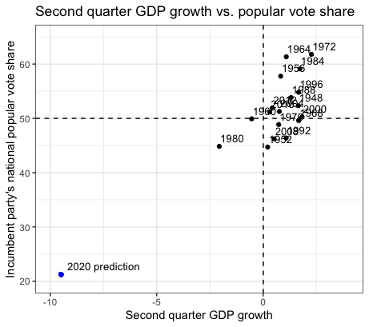

# The Economy in Popular Vote Predictions
## Sept 18, 2020

It's "the economy, stupid." Such was the famous words uttered by James Carville, Bill Clinton's campaign strategist, in 1992 as one of the three messages the campaign workers should focus on. This phrase perhaps best encapsulates the basic understanding most people have of the major role the economy plays in deciding elections. But can the economy help us predict elections? Recent literature has offered some insight into this question, with Healy and Lenz finding that voters primarily respond to the election year economy instead of longer-term economic figures ([Healy](https://www-jstor-org.ezp-prod1.hul.harvard.edu/stable/24363467?seq=1#metadata_info_tab_contents)). In turn, this blog will seek to understand how the economy can predict elections by analyzing the relationship between second quarter election-year economic variables and vote shares, fitting models for these data sets, and ultimately using the model with the greatest predictive power to predict the 2020 election.

**The Relationship between Election-Year Economic Variables and Popular Vote Share** 

GDP Quarterly Growth and GDP Yearly Growth  |  RDI Growth and Unemployment
:-------------------------:|:-------------------------:
|

GDP, Inflation, and RDI       |  Stock Open, Stock Close, and Stock Volume
:-------------------------:|:-------------------------:
|

In order to understand how the economy can predict election results, its important to first understand the relationship between election-year economic variables and the popular vote share. The graphics above display such, comparing second-quarter economic figures like unemployment and GDP against the incumbent popular vote shares from the years 1948-2016. Some of the major takeaways include:

* **A tenuous relationship.** The two-party vote share for the incumbent candidate has historically had a tenuous to moderate relationship with the various second-quarter economic variables. This is evident from the wide and nonlinear spread of data points in the top line of each graph. While this is to be expected for variables like GDP and stock volume, which are cumulative and generally increase regardless of presidential terms, other figures, like unemployment, vary significantly between presidential terms but still demonstrate a weak relationship with the incumbent vote share. The only variables which indicate some semblance of a moderate linear relationship with popular vote share are quarterly and yearly GDP growth.

* **Correlated economic variables.** The graphic also indicates that some economic variables are highly correlated with one another. For instance, GDP and RDI, or the stock open and the stock close, present strong positive linear relationships. Such suggests a bivariate model plotting multiple economic variables together might be redundant and unnecessary; rather, this blog will mainly consider univariate models for plotting the afromentioned economic variables and incumbent vote shares.

**Fitting Prediction Models** 

Now I will proceed with creating prediction models. I will do these for each of the second quarter election-year economic variables, running univariate linear regressions between such data and the historical incumbent vote share from 1948-2016. To evaluate the predictive power of each model, I will consider the variables listed in the table below. 

|  Model | Variable  | R-squared  | Mean Squared Error  | Leave One Out Validation  | Cross Validation |
|:-:|:-:|:-:|:-:|:-:|:-:|
| 1 | Quarterly GDP Growth  | 0.326   | 4.2  | -0.849  | 1.818  |
| 2 | Yearly GDP Growth  | 0.296  | 4.296  | -2.74  | 1.84  |
| 3  | GDP  | 0.039  | 5.019  | -1.369   | 2.02  |
| 4 | RDI  | 0.08  | 4.861  | -2.333  | N/A  |
| 5  | RDI Growth  | 0.258  | 4.367  | -3.192   | N/A  |
| 6 | Inflation  | 0.049  | 4.993  | -1.5  | 2.041  | 
| 7 | Unemployment  | 0.00004  | 5.12  | 0.887  | 2.251  |
| 8 | Stock Open  | 0.04  | 5.018   | -2.707  | 2.104  |
| 9  | Stock Close  | 0.04   | 5.019  | -2.776  | 1.967   |
| 10  | Stock Volume  | 0.05  | 4.99  | -2.243  | 2.265  |

The R-squared and Mean Squared Error (MSE) values listed above can help me determine a model's predictive power by indicating its in-sample fit. For example, a high r-squared or low MSE value would suggest a model has a high in-sample fit and thus higher predictive power. On the other hand, the "leave-one-out" and cross-validation values listed above can help me determine a model's predictive power by indicating its out-of-sample fit. In this case, a low value for either of these validations would suggest the model had a high out-of-sample fit and thus higher predictive power. When considering predictions, the out-of-sample validations are likely more important than the in-sample figures.

**Model Evaluations.** Based on the in-sample values, the majority of the listed models have a poor in-sample fit. With r-squared values ranging from 0.00004 to 0.326 and MSE values ranging from 4.2 to 5.12, the low in-sample fit for most of the economic-based models concords with the tenuous relationship previously established between the second quarter economic variables and incumbent popular vote share. The three models with the highest r-squared and lowest MSE values are model 1, model 2, and model 5.

Based on the out-of-sample values, the listed models also seem to have poor to moderate out-of-sample fits. The leave-one-out and cross-validation values ranged from -0.849 to -3.192 and 1.818 to 2.265, respectively. The three models with the lowest leave-one-out validation values are model 1, model 3, and model 7, while the three models with the lowest cross-validation values are model 1, model 2, and model 9. 

Considering both the in-sample and out-of-sample performance of each of the models, the model with the highest predictive ability is model 1, or the model based on the second-quarter GDP growth. With the highest r squared, lowest MSE, and lowest validation values, such a model has the greatest in-sample and out-of-sample fit, and will thus be the model I use for my final election prediction.  

**2020 Model Prediction** 

Using the univariate linear regression model based on second-quarter GDP growth, my prediction for the incumbent's popular vote share in 2020 is 21.26%; the blue point indicates this in the scatterplot above.

The prediction interval associated with my 2020 prediction ranges from a lower bound of -4.1% to an upper bound of 46.6%, which indicates the considerable uncertainty associated with such value. Moreover, the range in popular vote share predictions across all the models spanned from 21.26% to 80.33%, suggesting my 2020 prediction is highly sensitive to the economic variable chosen for my prediction model. Overall, my 2020 forecast and its associated uncertainty and sensitivity indicate how the economic model of voting behavior is not as clear cut as I might have initially assumed. In truth, my 2020 prediction is quite far-fetched considering how much of a landslide it would present relative to all previous elections in the dataset.

**Final Takeaways** 

Overall, our analysis has demonstrated that economic variables have a far more tenuous relationship with the incumbent vote share than one might have initially expected. After fitting models for various second-quarter election-year economic variables, I found that the model using the second-quarter GDP growth had the best in-sample and out-of-sample fit to historical incumbent vote shares; the prediction for the incumbent vote share in 2020 associated with this model is 21.26%. However, the uncertainty and sensitivity associated with such value leave room for incorporating variables not related to the economy in future prediction models. 

