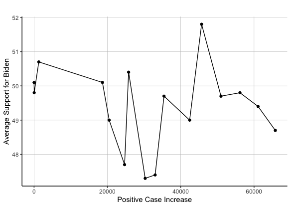
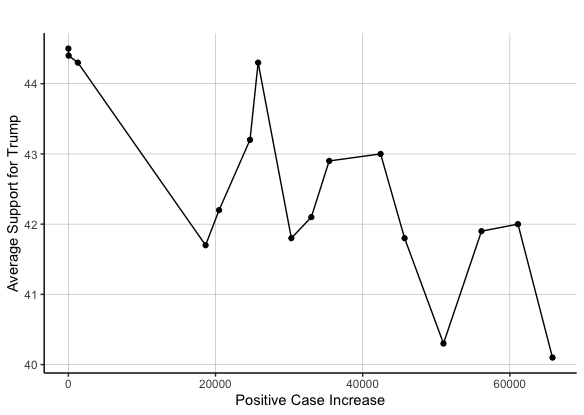
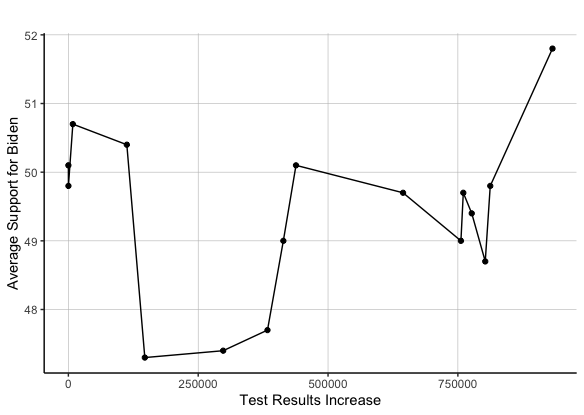
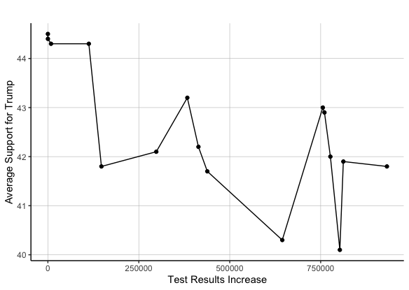

# COVID-19 Variables and Polls
## Oct 23, 2020

COVID-19 has been a permanent fixture in the news and everpresent in the minds of many people today, given its impact on people's work and daily life. Given such prevalence, this begs the question: how will COVID-19 affect the 2020 election? I will explore this topic by first noting the trends for three COVID-19 related variables, i.e., the daily increase in COVID-19 deaths, the daily increase in COVID-19 cases, and the daily increase in COVID-19 test results. Then, I will display the relationship between these variables and the average poll support for each candidate in the 2020 election, which will provide insight into how COVID-19 could impact each candidate's popular vote shares. 

**COVID-19 Trends in the United States**

Daily Increase in COVID-19 Deaths |  Daily Increase in COVID-19 Positive Cases 
:-------------------------:|:-------------------------:
|

| Daily Increase in COVID-19 Test Results |
|:-:|
|   |

The graphs above demonstrate trends for COVID-19 related variables like the increase in deaths, cases, and test results per day in the United States from late January to early October 2020. Some of the major takeaways include:

* **A general decrease in COVID-19 related daily deaths.** From the data available, the daily deaths attributed to COVID-19 has generally decreased from its peak in late April. This can be attributed to many factors, including a better understanding of the virus, better treatment available, etc.  

* **A general increase in COVID-19 related daily cases and test results.** From the data available, the daily cases and test results related to COVID-19 have generally increased since late January. However, daily cases peaked around mid-July, fell drastically, and has experienced a significant resurgence since September, while daily test results have increased consistently. 

**The Relationship between the 2020 Candidates' Average Support and COVID-19 Variables**

Relationship between Biden's Average Support and Daily COVID-19 Deaths |  Relationship between Trump's Average Support and Daily COVID-19 Deaths
:-------------------------:|:-------------------------:
|

**The relationship between the 2020 candidates' average poll support and daily increase of COVID-19 deaths.** The graphs above demonstrate the generally negative relationship between Biden's and Trump's average support in the polls and the daily increase of COVID-19 deaths in the United States. However, the relationship between the afromentioned variables is stronger for Biden than Trump. Such is evident given the r-squared values for the linear regressions between the two variables are 0.49 and 0.14 for Biden and Trump, respectively. This is noteworthy, given one would expect a stronger negative relationship between the daily increase of COVID-19 deaths and an incumbent candidate's average poll support relative to the non-incumbent. 

Relationship between the Daily Increase of COVID-19 Cases and Biden's Average Support  |  Relationship between the Daily Increase of COVID-19 Cases and Trump's Average Support 
:-------------------------:|:-------------------------:
|

**The relationship between 2020 candidates' average poll support and daily increase of COVID-19 cases.** The graphs above demonstrate a generally negative relationship between Trump's average support and the daily increase of COVID-19 cases. However, there appears to be little to no relationship between Biden's average support and the daily increase of COVID-19 cases. Such is further evidenced by the r-squared values for the linear regressions between the two variables, which is 0.61 for Trump and only 0.02 for Biden. This is distinct from the previous weak relationship between Trump's average support and the increase of COVID-19 deaths, suggesting COVID-19 cases, rather than deaths, could provide better insight into how COVID-19 might impact the election. 

Relationship between Daily COVID-19 Test Results and Biden's Average Support  |  Relationship between Daily COVID-19 Test Results and Trump's Average Support 
:-------------------------:|:-------------------------:
|

**The relationship between 2020 candidates' average poll support and daily increase of COVID-19 test results.** The graphs above demonstrate the generally negative relationship between Trump's average support and the daily increase of COVID-19 test results. However, there appears to be little to no relationship between Biden's average support and the daily increase of COVID-19 test results. This is also evidenced by the r-squared value for the linear regression between the two variables for each candidate, which is 0.46 for Trump and 0.01 for Biden. However, one should note any relationship between a candidate's average support and the daily increase of COVID-19 test results is likely confounded by the fact that COVID-19 test results have increased consistently over time; thus, a relationship between a candidate's average support and the daily increase of COVID-19 test results could merely be reflective of a candidate's average support trends over time.

**Implications for 2020 and Takeaways**

Ultimately, the previous relationships indicate that COVID-19 will negatively affect the incumbent candidate's popular vote share. Given the strong positive relationship I observed between a candidate's average support and their vote share in [previous blogs](Third_Blog_Polls.md), the strong negative relationship between Trump's average support and the increase in COVID-19 cases suggests such an increase in cases will negatively impact Trump's 2020 vote share. This is especially pertinent, given I have also demonstrated how daily COVID-19 cases are on the rise. 

On the other hand, COVID-19 will likely not affect the challenger's vote share. This is due to the weak relationship evident between Biden's average support and most of the COVID-19 variables I observed. Moreover, the negative relationship between Biden's average support and the increase in COVID-19 deaths will likely play a small role in the election, given the downward trend of COVID-19 daily deaths. 

Overall, my blog provided insight into the trends and relationships between COVID-19 variables and a candidate's average support, as well as how such variables might impact a candidate's vote share in the upcoming election. Hopefully, data from the 2020 race will provide further insight into how shocks, like a pandemic, can influence a candidate's vote share. 

