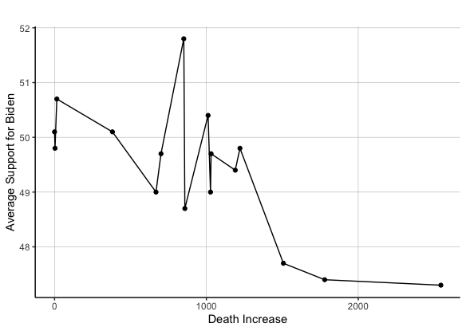
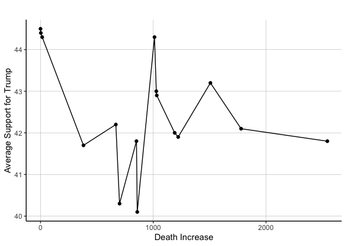

# COVID-19 Variables and Polls
## Oct 23, 2020

COVID-19 has been a permanent fixture in the news and everpresent in the minds of many people today, given its impact on people's work and daily life. Given such prevalence, this begs the question: how will COVID-related variables affect the 2020 election? I will explore this topic by first noting the trends for three COVID variables, i.e., the increase in cases, the increase in deaths, and the increase in test results per day relative to their respective totals. Then, I will display the relationship between these variables and the average poll support for each candidate, which will provide insight into how such variables might impact each candidate's popular vote shares (link week 3 when I talk about this later on).

**COVID-19 Trends in the United States**

Daily COVID-19 Deaths |  Daily COVID-19 Positive Cases 
:-------------------------:|:-------------------------:
|

| Daily COVID-19 Test Results |
|:-:|
|   |

The graphs above demonstrate trends for COVID-19 related variables like the increase in deaths, cases, and test results in the United States from late January to October 2020. Some of the major takeaways include:

* **General decrease in COVID-19 related daily deaths.** From the data available, the daily deaths attributed to COVID-19 has generally decreased from its peak in late April. Such can be attributed to many factors, including a better understanding of the virus, better treatment available, etc.  

* **General increase in COVID-19 related daily cases and test results.** From the data available, the daily cases and test results attributed to COVID-19 has generally increased since late January. However, daily test results have increased consistently, while daily cases peaked around mid-July, fell drastically, and have experienced a significant resurgence since September. 

**Relationship between COVID-19 Variables and 2020 Candidates' Average Support**

Relationship between Daily COVID-19 Deaths and Biden's Average Support  |  Relationship between Daily COVID-19 Deaths and Trump's Average Support 
:-------------------------:|:-------------------------:
|

**The relationship between daily COVID-19 deaths and 2020 candidates' average poll support.** The aforementioned graphs demonstrate the generally negative relationship between Biden's and Trump's average support in the polls and the daily COVID-19 deaths in the United States. However, the relationship between the afromentioned variables is stronger for Biden than Trump. Such is evident given the r-squared values for the linear regressions between the two variables for each candidate; the r-squared values between such variables are 0.49 and 0.14 for Biden and Trump, respectively. This is noteworthy, given one would expect the incumbent candidate, Trump, to exhibit a stronger negative relationship between COVID-19 deaths increase and their average poll support, as such deaths occured under their presidency.

Relationship between Daily COVID-19 Deaths and Biden's Average Support  |  Relationship between Daily COVID-19 Deaths and Trump's Average Support 
:-------------------------:|:-------------------------:
|

