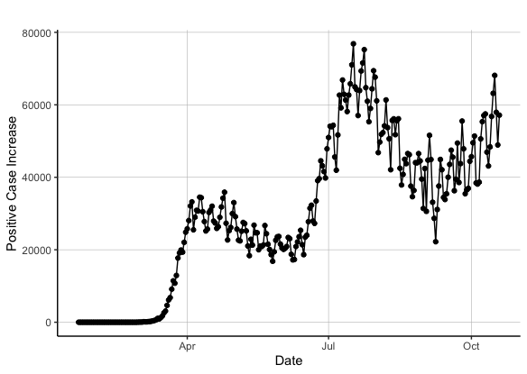
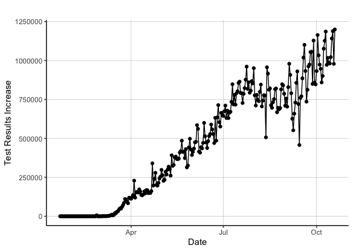

# COVID-19 Variables and Polls
## Oct 23, 2020

COVID-19 is an everpresent news fixture that has swept the nation and is in the mind of many people today, given changes to their work and day-to-day life based on such virus. Given its prevalance in the news and the general population, this begs the question: how will COVID-related variables affect the 2020 election? I will explore this topic by first noting the trends for three COVID vairables, i.e the increase in daily cases, the increase in daily deaths, and the increase in daily test results. Then, I will display the relationship between these variables to the average support in the polls of each candidate, which will provide some insight into the impact of such variables on each candidate's popular vote shares (link week 3 when I talk about this later on).

**COVID-19 Trends in the United States**

Daily COVID-19 Deaths Increase  |  Daily COVID-19 Positive Cases Increase
:-------------------------:|:-------------------------:
|

| Daily COVID-19 Test Results Increase  |
|:-:|
|   |

I will consider Covid 19 data from late january to october. 

**Relationship between COVID-19 Variables and 2020 Candidates' Average Support**

