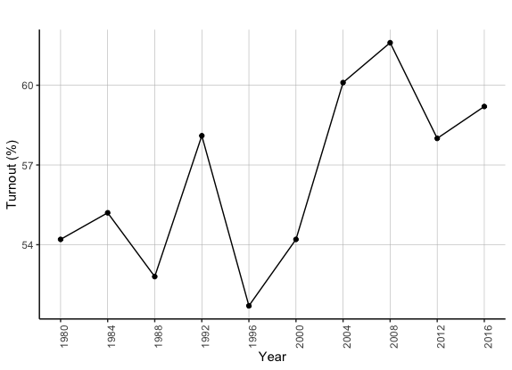
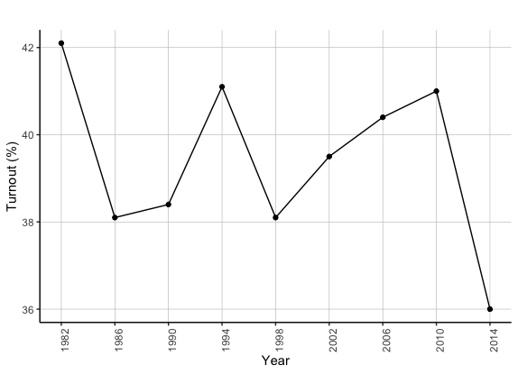

# Turnout in Popular Vote Predictions
## Oct 15, 2020

Campaigns have employed many strategies to mobilize their base and increase voter turnout throughout past presidential elections (source?). This begs the question: how can turnout help predict a candidate's popular vote share? In this blog, I will seek to answer such a question. I will first consider trends in turnout as a percentage for the voting-eligible population for the presidential and midterm elections. I will then incorporate this turnout variable in a linear regression model, stratified by party affiliation, and compare it to models from previous weeks. Finally, I will use this new model to predict the 2020 election, considering several turnout scenarios.

**Turnout Trends in the United States**

United States Presidential Election Turnout (1980-2016)  |  United States Midterm Election Turnout (1982-2014)
:-------------------------:|:-------------------------:
|

The graphs above demonstrate trends in the turnout rate (as a percentage of the voting-eligible-population) for United States elections from 1980 to 2016. Some of the major takeaways include: 

* **Increasing turnout for presidential elections.** From the data available, the voter turnout rate for presidential elections has generally increased from 1980 to 2016. This is evident given that the turnout rate for most elections before 2000 fell below 55% while such rate was above 59% for the majority of elections post-2000. 

* **Decreasing turnout for midterm elections.** From the data available, the voter turnout rate for midterm elections has generally decreased from 1982 to 2014. This is evident given that the turnout rate for midterm elections peaked around 42% in 1982 and fell to around 36% in 2014. However, one should note that the turnout rate increased consistently from 1988 to 2010 and was likely significantly higher in 2018 relative to 2014. 

**Incorporating Turnout Rate in Models and Model Comparison**

