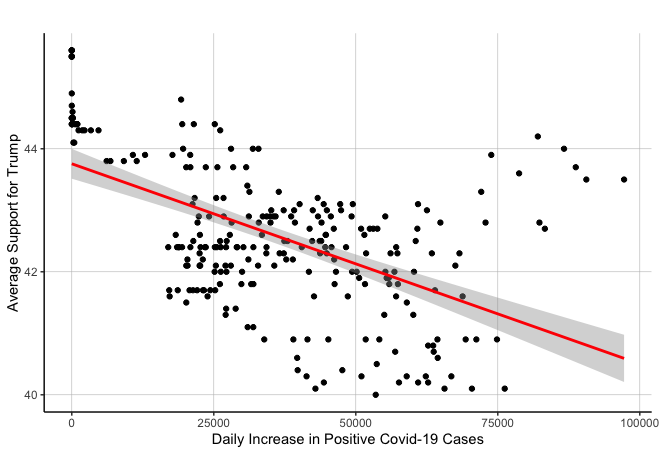
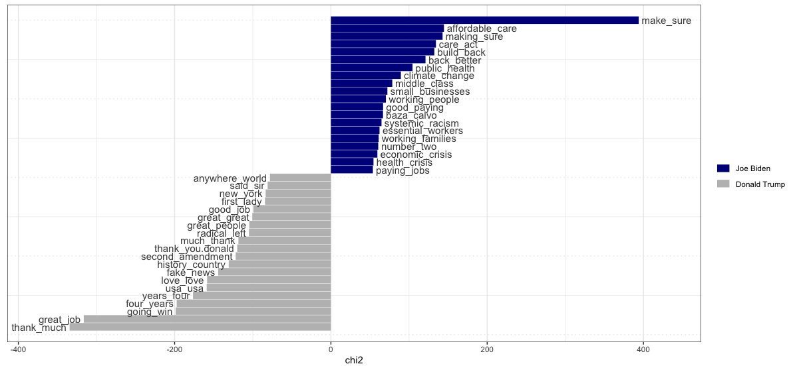

# Testing Narratives  
## December 1, 2020

In this blog, I will seek to provide an initial analysis of the evidence surrounding a post-election narrative on the pandemic's impact on Trump. I will do this by first summarizing the narrative and explaining why it is important to test such. Then I will explain the testable implications of this narrative and highlight how they can provide evidence for the afromentioned narrative. Finally, I will detail the results of the testable implications I identified, and ultimatley describe whether they support the narrative. 

**The Pandemic Narrative**

The main post-election narrative I will investigate is the notion that the coronavirus pandemic negatively impacted Trump's bid for re-election. Various media outlets, like the [Times](https://time.com/5907973/donald-trump-loses-2020-election/) and the [Washington Post](https://www.washingtonpost.com/elections/interactive/2020/trump-pandemic-coronavirus-election/), contributed this narrative by touting that the occurrence of such pandemic and all its associated issues dragged Trump's prospects for winning the election down and was a factor in his loss. Pundits, like [Sarah Longwell](https://time.com/5907973/donald-trump-loses-2020-election/), founder of the Republican Voters Against Trump, similarly reflected this sentiment and pointed towards the occurrence of the pandemic as an inhibiting factor on Trump's electoral efforts. The narrative largely builds off the major [pre-election day pandemic narrative](https://www.cnn.com/2020/10/29/politics/coronavirus-trump-analysis/index.html) of the same vein.

The pandemic narrative is important to test for several reasons. For one, the narrative is based on a unique shock to a presidential election. Given we have discussed shocks, among other variables, in our analysis of elections throughout this semester, testing how a prolonged shock like a pandemic could impact an incumbent candidate is a natural extension of what we have analyzed in class and would provide valuable insight into how we might incorporate such a shock when modeling future elections. The narrative is also important to test because the pandemic has influenced some of the variables we have analyzed over the semester, like the economy. Thus, testing the pandemic narrative would also provide a better understanding of an underlying factor influencing some of the variables we have incorporated in our models thus far and give a fuller overview of all the variables affecting the 2020 election.

**Testable Implications**

Ideally, the best test of the afromentioned pandemic narrative would be to compare Trump's actual popular vote share in an election where the pandemic occurred to Trump's popular vote share in a simultaneous and identical election where the pandemic did not happen. If Trump's vote share were lower in the election where the pandemic occurred, such would prove the pandemic hurt Trump's electoral prospects. In the absence of such an ideal test, there are a few testable implications I could analyze instead that could offer some preliminary evidence for the narrative. 

The main testable implication I will consider is whether there was a negative correlation between Trump's average support in the polls and the daily increase in Covid-19 cases. This implication is justifiable given, if the coronavirus pandemic negatively impacted Trump's bid for re-election, then the increasing prevalence of the virus, i.e., a rise in daily COVID-19 cases, would be negatively related to Trump's support in the polls (thus his chances at re-election). Therefore, by running a linear regression and observing the direction of the correlation between the two variables, I can analyze whether the data associated with such implication of the pandemic narrative is consistent with the afromentioned narrative.

To derive this correlation, I collected data on the daily increase in national Covid-19 cases and Trump's average support in the polls from the middle of February to election day in November. This will allow me to observe the relationship between the daily increase in Covid-19 cases and Trump's corresponding average support throughout the pandemic and the general election. The Covid-19 data comes from [The Covid-19 Tracking Project](https://covidtracking.com/about-data), which collects, cross-checks, and publishes Covid-19 data based on state and territory public health authorities; the average support data comes from [RealClear Politics](https://www.realclearpolitics.com/epolls/2020/president/us/general_election_trump_vs_biden-6247.html), who aggregate many national polls to derive a candidate's support in the polls. Given I will analyze the relationship between Trump's average support and the daily increase in Covid-19 cases over time, I will necessarily use national-level data. State and county-level data for Trump's average support in the polls are infrequent and limited, especially considering I want to analyze such variables throughout the pandemic and the election; thus, such data is not tenable.

A supplemental testable implication I will consider is whether Biden mentioned the pandemic or pandemic-related issues more than Trump throughout his campaign speeches. This implication is justifiable given, if the coronavirus pandemic negatively impacted Trump's bid for re-election, then Biden would logically try to bring the issue into the spotlight and mention it a lot throughout his campaign, while Trump would try to downplay its prevalence and shift focus away from the virus. In such a sense, the pandemic would play a similar role to the economy under [Vavrek](https://hollis.harvard.edu/primo-explore/fulldisplay?docid=TN_cdi_askewsholts_vlebooks_9781400830480&context=PC&vid=HVD2&search_scope=everything&tab=everything&lang=en_US), with Biden running a clarifying campaign on the pandemic and Trump running an insurgent one, given the purported impacts of the pandemic on Trump's electoral hopes. Of course, this implication assumes each campaign acted in their best interest, although I believe this assumption is fairly reasonable.

To measure whether Biden mentioned the pandemic more than Trump, I will conduct a chi-squared analysis comparing the differential association of keywords between Biden and Trump's campaign speeches. The campaign speech data I will focus on is an [aggregation of each candidate's campaign speeches](https://drive.google.com/drive/folders/1fvTLiMlJWgFpeVivFBdYxLm8vhHkhqcS) from March 1st, 2020 to November 4th, 2020, which again covers the duration of the pandemic up to election day. Of course, this analysis, perhaps more than the first test, has its limitations. But such is only meant to provide further preliminary evidence that the data is consistent or inconsistent with the pandemic narrative. 

**Testable Implication Results**

**Test #1**

As mentioned, my first test will consist of analyzing the correlation between Trump's average support and the daily increase in COVID-19 cases throughout the pandemic and the election. The graph below plots the resulting points and linear regression of such data:

|  The Average Support for Trump vs. the Daily Increase in Positive Covid-19 Cases for the 2020 Election |
|:-:|
||

The graph demonstrates that, generally, a greater daily increase in Covid-19 cases is associated with lower average support for Trump in the polls. The linear regression summarizes this negative relationship between the variables, with the coefficient for the daily increase in Covid-19 cases being negative. Given I identified the pandemic narrative's main testable implication to be that there was a negative correlation between Trump's average support in the polls and the daily increase in Covid-19 cases (i.e., the increase in the prevalence of the virus), the results of my first test seem to provide some initial support for the afromentioned narrative. 

Of course, there are some limitations to my test's findings. Mainly, although the linear regression in my first test demonstrates there was a negative correlation between the two variables in question, the correlation is admittedly not the strongest. The r-squared value of the linear regression is 0.314, which suggests the evidence my test provides for the first testable implication is less comprehensive than I might have initially expected. Moreover, my test does little to indicate the causal nature of the variables in question or the degree to which the pandemic might have hurt Trump overall. However, my test's ultimate goal was to provide initial evidence that the data is consistent with the notion that the pandemic negatively impacted Trump's electoral prospects. Regardless of its limitations, my first test was able to do this by demonstrating a negative correlation between Trump's average support in the polls and the daily increase in Covid-19 cases, i.e., demonstrating evidence for a testable implication of the narrative. 

**Test #2**

As previously described, I will also analyze a second testable implication to demonstrate whether there is further evidence that the data is consistent or inconsistent with the pandemic narrative. This test will consist of a chi-squared analysis comparing the differential association of keywords between both candidates' campaign speeches throughout the 2020 election, which is graphed below:

|  A Comparison of Joe Biden and Donald Trump's Campaign Speeches |
|:-:|
||

The text analysis demonstrates that Biden mentioned several pandemic-related phrases, like "health crisis," "essential workers," and "public health," significantly more than Trump in his campaign speeches throughout the pandemic. This falls in line with the supplemental testable implication I delineated before, which stipulates that Biden would try to clarify the pandemic issue and mention it frequently in his campaign speeches relative to Trump, who would do the opposite. This is further illustrated by the frequency table below:

| Covid-19 Related Phrases  |  Biden's Frequency of Use | Trump's Frequency of Use  |
|:-:|:-:|:-:|
|  public_health  | 123     | 13  |
| social_distancing  |  67     | 7  |
|   essential_workers  | 67    | 3  |
| preexisting_conditions  | 48   | 12  |
|  middle_pandemic  |  36  | 3  |
|  healthcare_workers |  36 | 11  |

This table affirms the notion that Biden mentioned pandemic-related phrases significantly more than Trump, which provides evidence for my second testable implication and ultimatley further supports the narrative that the pandemic negatively impacted Trump's chances for re-election. 

Of course, similar to the first test, there are several limitations associated with these results. As mentioned before, this testable implication is contingent on the assumption that each candidate's campaign operated in their best interests. However, if this assumption is not the case, then the fact that Biden mentioned pandemic-related phrases more than Trump provides less clear evidence in support of the pandemic narrative, given Biden's focus on the pandemic would not necessarily be based on the pandemic's negative impact on Trump.

Moreover, the results are subject to causality issues, as Biden may have focused more on the pandemic regardless of its effects on Trump's re-election chances; for instance, Democrats tend to focus more on issues like health than Republicans. Finally, such a test offers no insight on the degree to which the pandemic might have negatively impacted Trump. However, these limitations are expected, given this test only seeks to provide initial and supplemental evidence for my narrative. Considering my text analysis demonstrates evidence for my second testable implication, the results above are able to provide additional data consistent with the notion that the pandemic negatively impacted Trump's electoral prospects. 

**Takeaways**

Ultimatley, both my testable implications were able to provide some preliminary evidence that the pandmic negativley impacted Trump. Although there were limitations on both of them, such demonstrates that data thus far is consistent with narrrative. Looking towards the future, would be interesting to get further evidence to improve to strength of these testable implications, and more compehrensivley test the validitiy of narrrative. but for now, results seem enouraging to the pandemic narrative I deliniated. 

