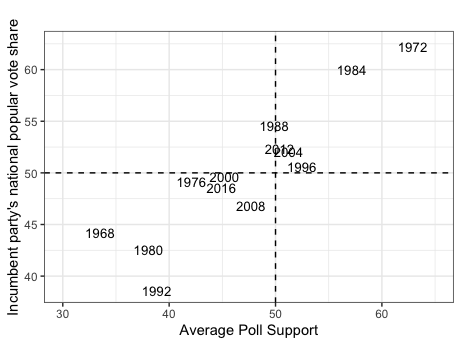
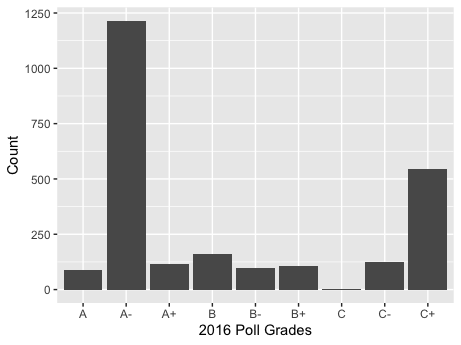
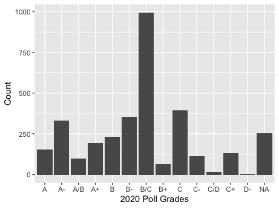

# Polls in Popular Vote Predictions
## Sept 24, 2020

Polls have become a mainstay in the modern-day election. From the moment the primaries start to the moment elections end, the media coverage of a candidates' approval rating is non-stop. While such can be largely attributed to horse-race journalism, the emphasis on polls during the campaign season does beg the question as to how predictive polls are in presidential elections. We will consider this question first by analyzing the historical relationship between a candidate's average support in the polls and their subsequent popular vote share. Then, we will consider the variation in the pollster quality in recent elections and construct a predictive model based on weighing these differences in poll quality. Finally, we will compare such model to previous and unweighted average support models, and use the model with the least error relative to the 2016 results to predict the 2020 election.

**The Relationship between a Candidate's Average Poll Support and Popular Vote Share** 

Average Poll Support vs. Incumbent Popular Vote Share (1968-2016) |  Average Poll Support vs. Challenger Popular Vote Share (1968-2016)
:-------------------------:|:-------------------------:
|

To understand how polls can predict election results, it is necessary to first understand the relationship between a candidate's average poll support and their popular vote share. The graphics above display historical trends for such, using aggregated measures of poll support for an incumbent or non-incumbent candidate six weeks before an election and said candidates' popular vote shares from 1968 to 2016. Some of the major takeaways include:

* **A strong relationship.** The graphs indicate that a candidate's average support in the polls has historically been highly related to their respective popular vote shares. This is evident based on the generally linear and relativley narrow spread of the data points for both the incumbent and challenger graphs. 

* **Higher incumbent accuracy.** While both graphs present strong and linear relationships for the variables in question, it is also clear that the relationship between a candidate's average support and their popular vote share is stronger for incumbent candidates than non-incumbent candidates. Such can be seen by the data points in the incumbent graph falling closer to a one-for-one diagonal line between the x-axis and y-axis than the non-incumbent graph. 

**The Variation in Pollster Quality** 

2016 Polls  |  2020 Polls
:-------------------------:|:-------------------------:
|

When considering the relationship between the polls and a candidate's popular vote share, one must also be cognizant of the differences in quality between various polls. The graphic above demonstrates the variation in quality for national polls in the 2016 and 2020 elections, graded by FiveThirtyEight based on a given pollster's historical accuracy and methodology.

**Uneven distribution.** One of the most apparent takeaways from analyzing the above graphs is that the 2016 and 2020 national election polls are not distributed equally across the quality. For example, for the 2016 election, there is a massive spike of A- and C+ graded polls, with relatively low counts for the rest of the grades. Similarly, in 2020 there is a massive spike of B/C graded polls with lower counts for the other grades.

**Constructing a Prediction Model** 

When constructing a prediction model, we will consider its prediction for 2016 to evaluate such a model against the actual popular vote results for both the incumbent and the non-incumbent party candidates.

Given the relationship between the polls and the popular vote, as well as the variation in quality between different polls, the first component of our 2016 prediction model will be aggregate support of 2016 national polls, weighted for quality. Polls with a higher grade will be weighted greater, or polls with grades of A+, A, and A- will receive a weight of 0.8, 0.2, and 0.05, respectively.

The second component will be second-quarter GDP, given such variable was the economic variable most related to popular vote shares in last week's blog post (link in last week).

Each of these components is weighted equally in our final prediction model for 2016. Given such a model, the prediction for the incumbent party candidate is 47.24%, and the prediction for the non-incumbent party candidate is 44.15%. Given the actual results were 47.06% and 44.92%, respectively, such a model seems viable; however, an evaluation of its predictive ability against other models is still necessary.

**Evaluating Prediction Models** 

| Model  | Variable(s)  | 2016 Incumbent Prediction  | 2016 Non-Incumbent Prediction  | Total Error  |
|:-:|:-:|:-:|:-:|:-:|
|  1 | Weighted Aggreagate Poll Support, 2nd Quarter GDP  | 47.24%  | 44.15%  | 0.96  |
|  2 | 2nd Quarter GDP  | 48.26%  | 47.44%  | 3.69  |
|  3 |  Average Poll Support | 46.88%  | 45.02%  | 0.28  |
|  4 |  Average Poll Support, 2nd Quarter GDP |46.47%   | 46.68%  | 2.35  |

The table above compares the 2016 prediction for the model I constructed (denoted as Model 1) agaisnt the out-of-sample 2016 prediciton for various linear regression models; these linear regression models were based on the variables listed for Model 2, Model 3, and Model 4. Total error was calculated by summing the absolute value of the differences between a model's predictions and the actual popular vote results. 

Given the total error values in the chart above, the model with the least error, and thus best prediction for the 2016 election, was Model 3. This concords with the relationship we observed earlier between average poll support and popular vote, and thus leads me to choose Model 3 for my 2020 election prediction. 

**Model Prediction for 2020** 

Using the univariate linear regression model based on average poll support for a given candidate (Model 3), my prediction for the incumbent party candidate's popular vote share in 2020 is 46.99% and 49.5% for the non-incumbent party candidate. 

The prediction interval associated with my 2020 incumbent-party prediction ranges from a lower bound of 40.27% to an upper bound of 53.7%, while the prediction interval for my 2020 non-incumbent party prediction ranges from 40.65% to 58.36%. This indicates there is still some notable uncertainity associated with my predictions, although far less than when my model was based soley on second-quarter GDP last week. 

