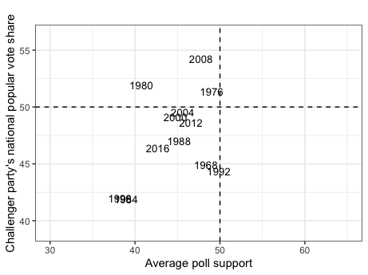
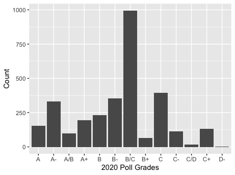
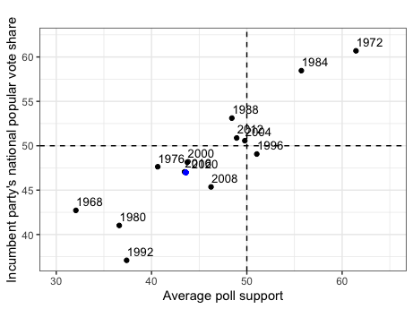
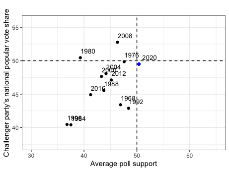

# Polls in Popular Vote Predictions
## Sept 24, 2020

From the moment the primaries start to the moment the general election ends, media coverage of a candidates' approval ratings seems non-stop. While such can be largely attributed to horse-race journalism, the emphasis on polls during the campaign season begs the question as to how predictive polls are in presidential elections. We will consider this question first by analyzing the historical relationship between a candidate's average support and their subsequent popular vote share. Then, we will consider the variation in the pollster quality and construct a predictive model based on weighing higher-quality polls greater. Finally, we will compare such a model to previous linear regression models and use the model with the least error relative to the 2016 results to predict the 2020 election.

**The Relationship between a Candidate's Average Poll Support and Popular Vote Share** 

Average Poll Support vs. Incumbent Popular Vote Share (1968-2016) |  Average Poll Support vs. Challenger Popular Vote Share (1968-2016)
:-------------------------:|:-------------------------:
|

To understand how polls can predict election results, it is necessary to first understand the relationship between a candidate's average support in the polls and popular vote share. The graphics above display historical trends for such, using aggregated measures of poll support for an incumbent or non-incumbent candidate six weeks before an election and said candidates' popular vote shares from 1968 to 2016. Some of the major takeaways include:

* **A strong relationship.** The graphs indicate that a candidate's average support in the polls has historically been highly related to their respective popular vote share. This is evident based on the mostly linear and relatively narrow spread of the data points for both graphs.

* **Higher incumbent accuracy.** The graphic also illustrates how the relationship between a candidate's average support and popular vote share is stronger for incumbent party candidates than non-incumbent party candidates. Such can be seen by the data points in the incumbent party graph falling closer to a one-for-one diagonal line between the x-axis and y-axis than the non-incumbent party graph.

**The Variation in Pollster Quality** 

2016 Polls Grade Distribution  |  2020 Polls Grade Distribution
:-------------------------:|:-------------------------:
|

When considering the relationship between the polls and a candidate's popular vote share, one must also be aware of the differences in quality between various polls. The graphic above demonstrates the variation in quality for national polls in the 2016 and 2020 elections, graded by FiveThirtyEight based on a given pollster's historical accuracy and methodology.

**Uneven distribution.** The most apparent takeaway from analyzing the above graphs is that the 2016 and 2020 national election polls are not distributed equally for quality. For example, in 2016, there was a massive spike of A- and C+ graded polls, with relatively low counts for the rest of the grades. Similarly, in 2020 there is a massive spike of B/C graded polls with lower counts for the other grades. In short, there is significant variation present in 2016 and 2020 pollster quality. 

**Constructing a Prediction Model** 

When constructing a prediction model, we will consider its prediction for 2016 relative to the 2016 popular vote results to evaluate its predictive ability.

Given the relationship between the polls and the popular vote, the first component of our 2016 prediction model will be a candidate's aggregate support from 2016 national polls. However, we will weigh polls of higher quality greater, given the variation in pollster quality we observed earlier; thus, polls with grades of A+, A, and A- will receive a weight of 0.8, 0.2, and 0.05, respectively, in our average support figure. 

The second component of our model will be second-quarter GDP, given such was the economic variable most related to popular vote shares in [last week's blog post](Second_Blog_Economy.md).

Each of these components is weighted equally in our final prediction model for 2016. Given such a model, the prediction for the 2016 incumbent party candidate is 47.24%, and the prediction for the 2016 non-incumbent party candidate is 44.15%. Given the actual popular vote results were 47.06% and 44.92%, respectively, such a model seems viable; however, an evaluation of its predictive ability against other models is also necessary.

**Evaluating Prediction Models** 

| Model  | Variable(s)  | 2016 Incumbent Prediction  | 2016 Non-Incumbent Prediction  | Total Error  |
|:-:|:-:|:-:|:-:|:-:|
|  1 | Weighted Aggreagate Poll Support, 2nd Quarter GDP  | 47.24%  | 44.15%  | 0.96  |
|  2 | 2nd Quarter GDP  | 48.26%  | 47.44%  | 3.69  |
|  3 |  Average Poll Support | 46.88%  | 45.02%  | 0.28  |
|  4 |  Average Poll Support, 2nd Quarter GDP |46.47%   | 46.68%  | 2.35  |

The table above compares the 2016 prediction from the model I constructed (Model 1) against the out-of-sample 2016 prediction from various linear regression models. These linear regression models are based on the variables listed for Model 2, Model 3, and Model 4. The total error is calculated by summing the absolute value of the differences between a model's predictions and the actual popular vote results.

The model with the least error, and thus best predictive ability relative to the 2016 election, is Model 3. This concords with the relationship we observed earlier between average support and popular vote share and leads me to choose Model 3 for my 2020 election prediction. Such also means I will abandon last week's model (Model 2), based solely on second-quarter GDP, as well as the model weighted for higher poll quality (Model 1).

**Model Prediction for 2020** 

2020 Incumbent Party Prediction  |  2020 Challenger Party Prediction
:-------------------------:|:-------------------------:
|

Using the univariate linear regression model based on average support for a given candidate (Model 3), my prediction for the 2020 incumbent party candidate's popular vote share is 46.99% and 49.5% for the non-incumbent party candidate; these predictions are denoted as the blue dots in the graphic above.

The prediction interval associated with my 2020 incumbent-party prediction ranges from a lower bound of 40.27% to an upper bound of 53.7%, while the prediction interval for my 2020 non-incumbent party prediction ranges from 40.65% to 58.36%. This indicates there is some uncertainty associated with my predictions, although such is far less than when my model was based solely on second-quarter GDP.

**Final Takeaways** 

Overall, our analysis has demonstrated a significant relationship between average poll support and popular vote share. After comparing various models, I found that the model reliant on a candidate’s average poll support had the greatest predictive ability relative to the 2016 election; I then used it to predict the 2020 election. Given the linear regression model for average poll support was more predictive than the model incorporating aggregate poll support weighted for higher quality polls and second-quarter GDP, it seems that poll quality is not a major factor in the predictive ability of polls; this is likely a function of poll biases canceling out in large samples of polls. Future models should consider applying different weights to polls and 2nd quarter GDP or even incorporating new variables altogether. 

